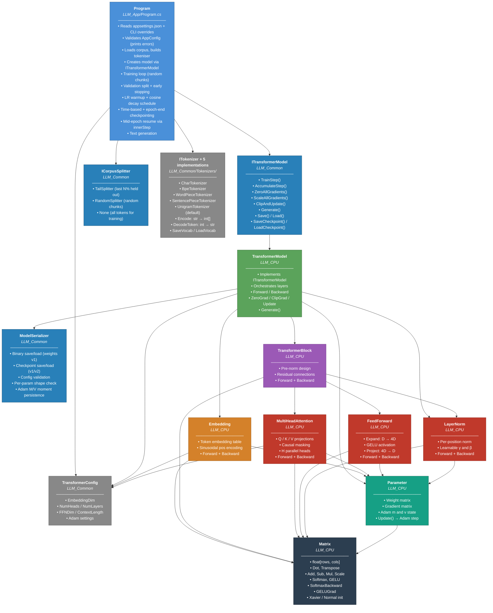
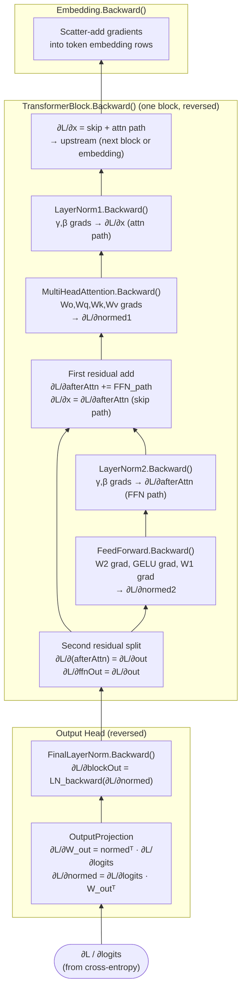
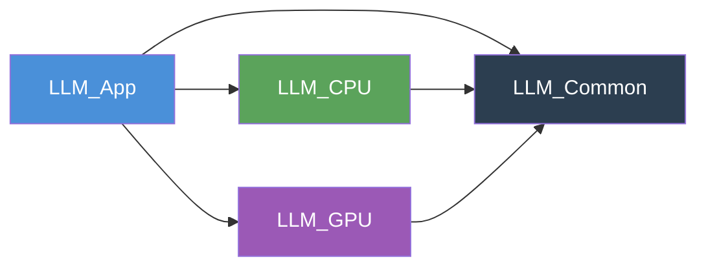
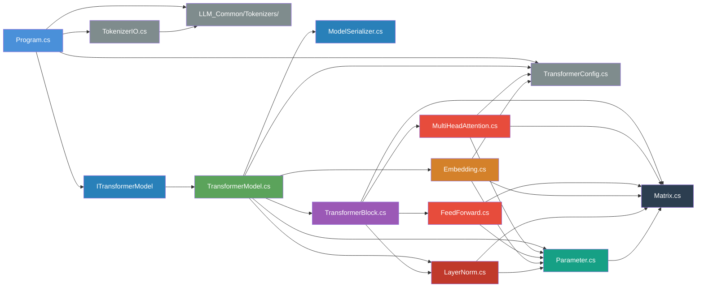

# Architecture — Class Structure & Program Flow

This document describes the code architecture of the LLM solution: how the source
files relate to each other, what each class is responsible for, and how data flows
through the system from startup to trained model.

The solution is split into five projects:

| Project | Role |
|---|---|
| `LLM_Common` | Shared interfaces, config, serializer |
| `LLM_CPU` | CPU backend — all math in managed C# |
| `LLM_GPU` | GPU backend — ILGPU kernels on CUDA / OpenCL |
| `LLM_App` | Entry point, CLI, training loop |
| `LLM_Documentation` | Documentation only (never compiled) |

---

## CPU Backend — Class Dependency Graph

The diagram below shows every CPU-side class and the **depends-on** relationship
between them (an arrow `A → B` means "A uses B").

---

## GPU Backend — Class Summary

The GPU backend (`LLM_GPU`) mirrors the CPU backend class-for-class but stores matrices
in device memory and executes operations via ILGPU kernels.

| GPU class | CPU equivalent | Notes |
|---|---|---|
| `GpuContext` | _(none)_ | ILGPU accelerator singleton; prefers CUDA → OpenCL → CPU |
| `GpuMatrix` | `Matrix` | GPU-resident float buffer; operations launch kernels |
| `GpuParameter` | `Parameter` | Weight + gradient + Adam state on device |
| `GpuEmbedding` | `Embedding` | |
| `GpuLayerNorm` | `LayerNorm` | |
| `GpuMultiHeadAttention` | `MultiHeadAttention` | |
| `GpuFeedForward` | `FeedForward` | |
| `GpuTransformerBlock` | `TransformerBlock` | |
| `GpuTransformerModel` | `TransformerModel` | Implements `ITransformerModel` |
| `Kernels` | _(Math.cs / Matrix.cs)_ | All GPU kernel definitions (static methods compiled by ILGPU) |

`ITransformerModel` (in `LLM_Common`) is the interface that allows `Program.cs` to be
completely backend-agnostic — a single `--gpu` flag switches the entire model at runtime.

---

## Program Execution Flow

The diagram below traces the program from startup through one training epoch
and then to text generation.

```mermaid
flowchart TD
    START([Program starts])

    subgraph INIT["Initialisation"]
        direction TB
        A["Parse args\n--cpu/--gpu  --train  --load  --save  --prompt"]
        B["Read corpus file (required if --train;\nskipped if --load and .vocab file exists)"]
        C["Build tokeniser:\n  If <load>.vocab exists → TokenizerIO.LoadVocab()\n  Else → new UnigramTokenizer(corpus, 500)\nCorpus string → int[] allTokens (if --train)"]
        D["new TransformerConfig\nSet hyperparameters"]
        E["Create model via ITransformerModel\n  --cpu → new TransformerModel(cfg, rng)\n  --gpu → new GpuTransformerModel(cfg, rng)\n(~800 K parameters at default config)"]
        F["If --load: model.Load(path) + tokenizer from path.vocab\nRead binary weights, validate config, restore vocab"]
    end

    subgraph TRAIN["Training Loop  (if --train)"]
        direction TB
        G["stepsPerEpoch = (len(tokens) - T - 1) / T + 1"]
        H["Pick random offset in [0, len(tokens)-T-1]\nExtract input[0..T-1] and target[1..T]"]
        I["If AccumulationSteps=1:\n  model.TrainStep() — ZeroGrad→Forward→Backward→Clip→Adam\nElse:\n  Accumulate N chunks, ScaleGrads(1/N), ClipAndUpdate"]
        J{More steps this epoch?}
        K["Log epoch loss and perplexity\nEvery SampleEvery epochs: generate a sample"]
        L{More epochs?}
    end

    subgraph SAVE["After training"]
        M["If --save: model.Save(path) + tokenizer.SaveVocab(path+'.vocab')\nWrite binary weights and companion vocabulary file"]
    end

    subgraph GEN["Text Generation  (if --prompt)"]
        direction TB
        N["tokenizer.Encode(prompt) → int[]"]
        O["model.Generate(promptIds, numTokens:200,\ntemperature:0.8, topK:15)"]
        P["Autoregressive loop:\n  Forward → last-position logits\n  → temperature scale → top-k mask\n  → softmax → categorical sample\n  → append token, repeat"]
        Q["tokenizer.DecodeToken() each output ID\nPrint generated text"]
    end

    START --> INIT
    A --> B --> C --> D --> E --> F
    F --> TRAIN
    G --> H --> I --> J
    J -- yes --> H
    J -- no  --> K --> L
    L -- yes --> H
    L -- no  --> SAVE --> GEN
    N --> O --> P --> Q
```

---

## Backward Pass Data Flow

During backpropagation the gradient signal travels in the **opposite direction**
to the forward pass.  The diagram below shows the gradient flowing through one
transformer block.

---

## Project Dependency Map

## CPU File Dependency Map

