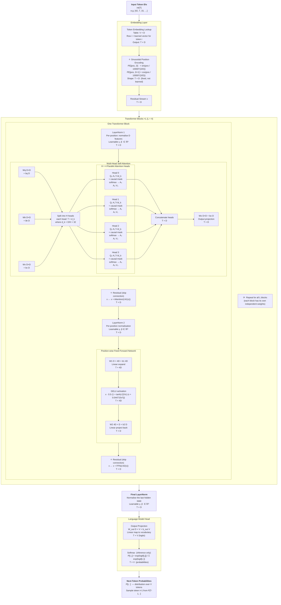
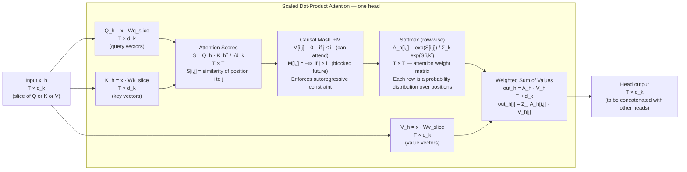
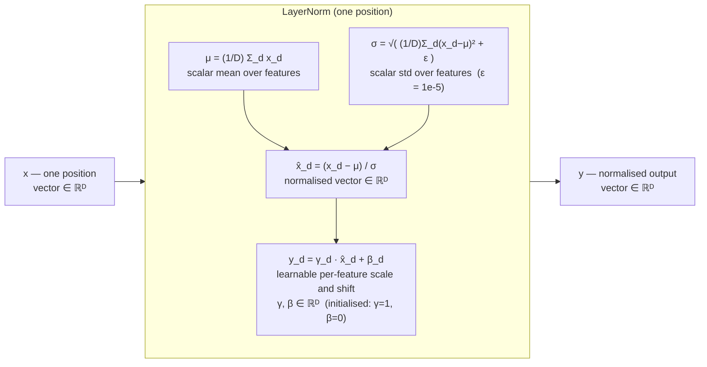
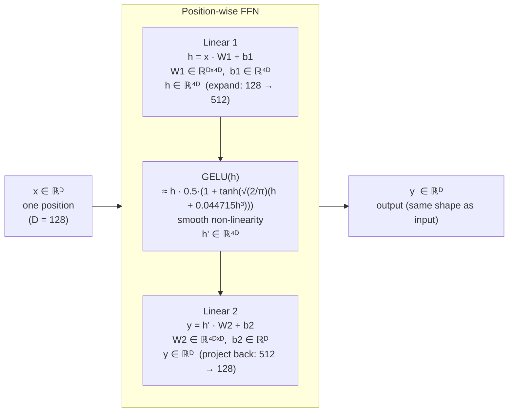
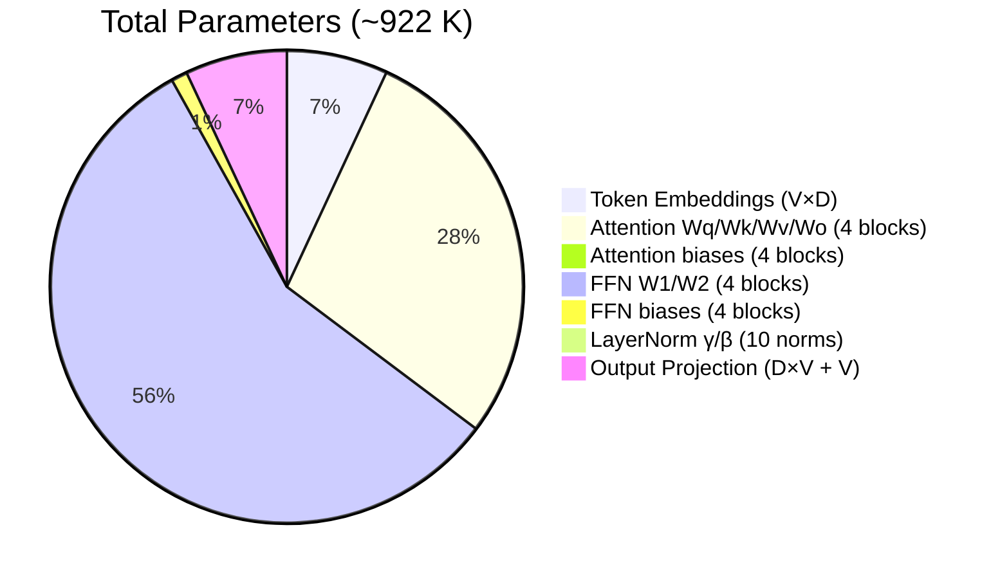
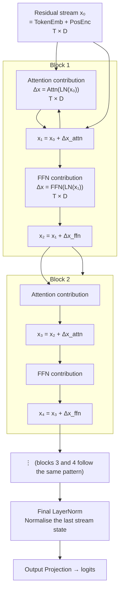

# Neural Network Structure

This document describes the exact neural network implemented by this project,
showing every layer, its dimensions, internal nodes, and how data flows and
transforms from raw token IDs to next-token probability distributions.

The architecture is a **decoder-only transformer** (GPT-style) — the same
fundamental design used in GPT-2, GPT-3, GPT-4, Llama, Mistral, and Claude.

---

## Full Network — High-Level Data Flow

The diagram below shows the entire network for a sequence of **T tokens**,
with **L = 4 transformer blocks** and a vocabulary of **V tokens**.
Tensor shapes are shown at each stage (`T` = sequence length, `D` = `EmbeddingDim`,
`V` = `VocabSize`).

---

## Attention Head Detail

Each of the **H = 4** attention heads performs scaled dot-product attention
over its own d_k = 32-dimensional subspace.

---

## Layer Normalisation Detail

Applied independently at each of the T sequence positions over the D features.

---

## Feed-Forward Network Detail

The same MLP (shared weights) is applied to every position independently.

---

## Parameter Count Breakdown

With the default configuration (D=128, H=4, L=4, d_ff=512, V≈500 from Unigram tokeniser):

| Component | Formula | Count (default) |
|---|---|---|
| Token embedding | V × D | 64 000 |
| Per block: Q/K/V/O weights | 4 × D² | 65 536 |
| Per block: Q/K/V/O biases | 4 × D | 512 |
| Per block: FFN weights | D×4D + 4D×D | 131 072 |
| Per block: FFN biases | 4D + D | 640 |
| Per block: LayerNorm (×2) | 2 × 2D | 512 |
| **Per block total** | | **~198 272** |
| **All L=4 blocks** | | **~793 088** |
| Final LayerNorm | 2D | 256 |
| Output projection + bias | D×V + V | 64 500 |
| **Grand total** | | **~921 844** |

---

## Residual Stream View

The **residual stream** is the central abstraction of the transformer.
It starts as the embedding of the input and is incrementally updated by each
sub-layer.  No layer replaces the stream — each one only adds to it.

The residual connections mean that gradients flow directly from the loss all the way
back to the embedding layer through the identity shortcut, making very deep networks
trainable without gradient vanishing.
