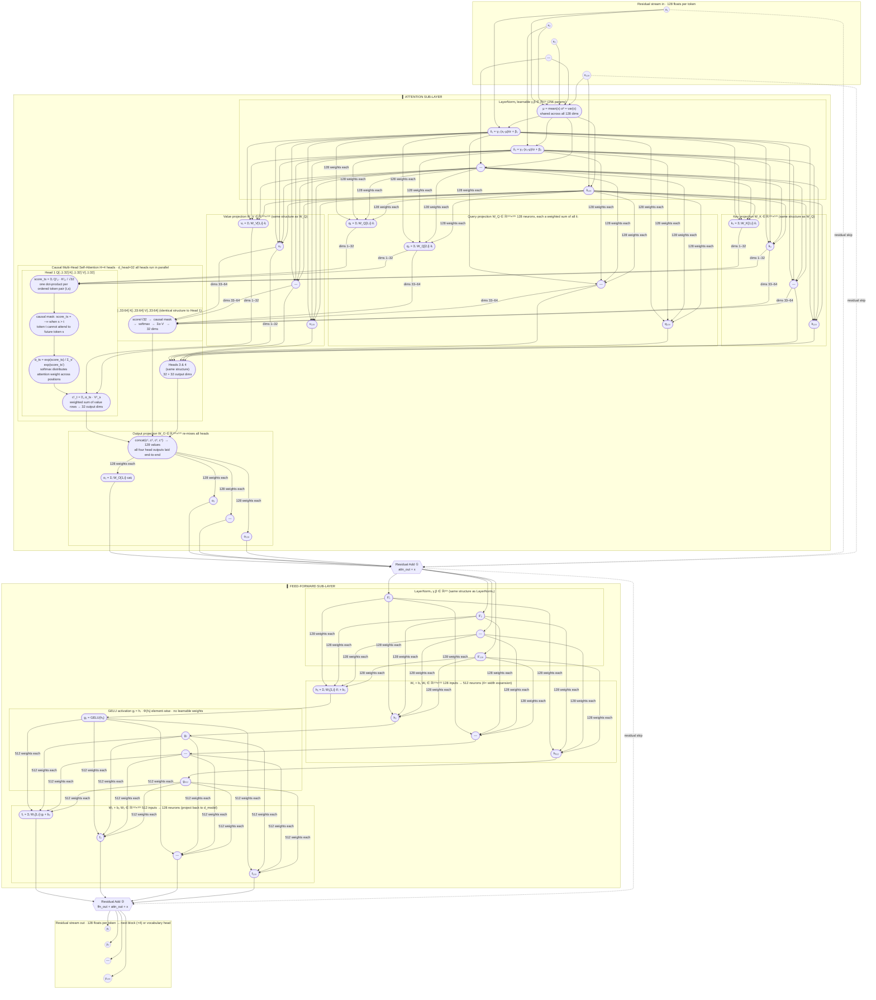

# Transformer Block — Perceptron-Level Diagram

A single transformer block processes one vector of **d_model = 128 floats per token position**.
The block contains two sub-layers, each wrapped in a residual ("skip") connection.
Four of these blocks are stacked (`NumLayers = 4`).

Representative neurons are shown; `⋯` nodes stand for the remaining dimensions.
Solid arrows carry activations; dashed arrows are residual (skip) connections.

---

---

## Layer-by-layer summary

| Step | Operation | Shape | Learned params |
|------|-----------|-------|----------------|
| 1 | **LayerNorm₁** — normalize each dimension using μ,σ across all 128 dims, then scale+shift | 128→128 | γ, β ∈ ℝ¹²⁸ (256) |
| 2 | **Q projection** — each output neuron is a weighted sum of all 128 normed inputs | 128→128 | W_Q (16 384) |
| 3 | **K projection** — same structure as Q | 128→128 | W_K (16 384) |
| 4 | **V projection** — same structure as Q | 128→128 | W_V (16 384) |
| 5 | **Slice into heads** — Q, K, V are split into H=4 slices of 32 dims each | 128→4×32 | none |
| 6 | **Attention scores** — per head: dot product of every Q row with every K row, scaled by 1/√32 | T×32, T×32 → T×T | none |
| 7 | **Causal mask** — set score to −∞ for any future key position (s > t) | T×T | none |
| 8 | **Softmax** — convert masked scores to attention weights that sum to 1 per query row | T×T | none |
| 9 | **Weighted sum** — per head: each output row = Σ_s weight_s × V_s (sum of value rows) | T×T, T×32 → T×32 | none |
| 10 | **Concat heads** — stack the four 32-dim outputs end-to-end | 4×32→128 | none |
| 11 | **Output projection W_O** — fully connected: each output neuron reads all 128 concat values | 128→128 | W_O (16 384) |
| 12 | **Residual Add ①** — add the original input x, bypassing attention entirely | 128 | none |
| 13 | **LayerNorm₂** — same structure as LayerNorm₁ | 128→128 | γ, β (256) |
| 14 | **W₁ + GELU** — expand: 128 inputs → 512 neurons, each a full dot product, then GELU | 128→512 | W₁ (65 536), b₁ (512) |
| 15 | **W₂** — compress: 512 GELU outputs → 128 neurons, each a full dot product | 512→128 | W₂ (65 536), b₂ (128) |
| 16 | **Residual Add ②** — add the output of Residual Add ①, bypassing the FFN entirely | 128 | none |

**Total params per block ≈ 197 888**
Four blocks + embedding table + final projection ≈ **800 000 parameters** for the default config.

## Key connectivity rules

- **Fully connected (dense)**: Q/K/V/W_O projections and both FFN linear layers.
  Every output neuron receives a signal from every input neuron via a learned weight.

- **Element-wise (one-to-one)**: LayerNorm scale+shift (after statistics are computed), GELU activation.
  Neuron i in one layer connects only to neuron i in the next.

- **All-to-one (then one-to-all)**: The μ,σ statistics in LayerNorm are computed from all inputs and then broadcast into every output neuron.

- **Cross-position (attention only)**: The attention weighted sum lets token *t* aggregate information from any earlier token *s ≤ t*. Every other operation is **position-independent** — the same weights process each position identically.
